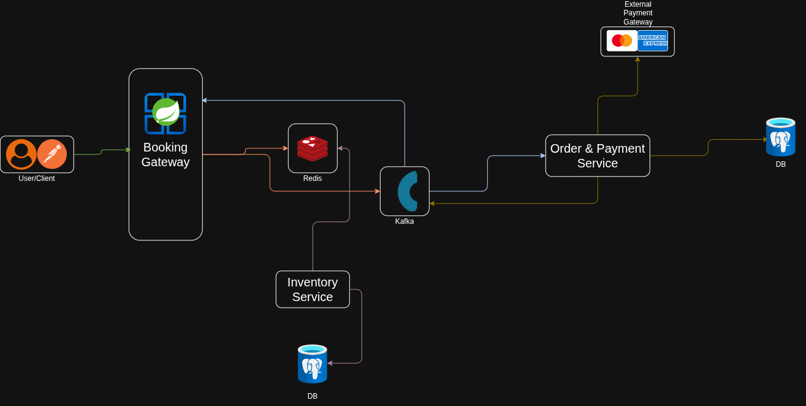

# High-Concurrency Ticket Reservation System

A Java Spring Boot microservice project for reserving tickets reliably during high-demand events. The system is organized around independently deployable services so traffic, inventory, ordering, and configuration can scale separately.

## Architecture



The system is organized around independently deployable services so traffic, inventory, ordering, and configuration can scale separately.

### Services

| Service                 | Responsibility                                                                                |                                   Default port |
| ----------------------- | --------------------------------------------------------------------------------------------- | ---------------------------------------------: |
| `booking_gateway`       | Entry point for booking requests, security, Redis integration, and service-to-service routing | Spring Boot default unless configured remotely |
| `inventory_service`     | Manages ticket inventory and availability                                                     | Spring Boot default unless configured remotely |
| `order_payment_service` | Handles orders and payment-related processing                                                 | Spring Boot default unless configured remotely |
| `service_discovery`     | Eureka service registry used by the microservices to find one another                         |                                         `8761` |
| `config_server`         | Loads shared, environment-specific configuration from a Git repository                        |                                         `8079` |

## Technology

- Java 25
- Spring Boot 4.1.x
- Spring Cloud 2025.1.3
- Spring MVC
- Spring Data JPA and PostgreSQL
- Redis 7.2 for fast, shared state and reservation coordination
- Spring Security and JWT support
- Apache Kafka dependency in the booking gateway for event-driven communication
- Maven Wrapper for repeatable builds

## High-concurrency focus

Ticket inventory is a contention-heavy resource: many users may try to reserve the same tickets at the same time. This project is intended to support that workload by separating responsibilities across services and using Redis for low-latency shared coordination. The inventory and order services persist business data in PostgreSQL, while Eureka and Config Server keep service location and configuration centralized.

The exact reservation consistency strategy, expiration policy, and Kafka topics are configured or implemented within the individual services and should be treated as part of the evolving application design.

## Prerequisites

- JDK 25
- Docker and Docker Compose
- Git access to the configuration repository, unless each service is run with local configuration overrides
- PostgreSQL and Kafka when running the inventory and order/payment flows

## Running locally

1. Start Redis from the repository root:

   ```bash
   docker compose up -d redis
   ```

   Redis is exposed on `localhost:6379`. The default development password is `pranay123`; set `REDIS_PASSWORD` to override it.

2. Start the service discovery server:

   ```bash
   cd service_discovery
   ./mvnw spring-boot:run
   ```

   Eureka is available at `http://localhost:8761`.

3. Start the Config Server:

   ```bash
   cd config_server
   ./mvnw spring-boot:run
   ```

   It runs at `http://localhost:8079`. Set `GITHUB_URI`, `GITHUB_USERNAME`, `GITHUB_PASSWORD`, and `EUREKA_DEFAULT_ZONE` when your environment needs non-default values.

4. Start the application services in separate terminals:

   ```bash
   cd booking_gateway
   ./mvnw spring-boot:run
   ```

   ```bash
   cd inventory_service
   ./mvnw spring-boot:run
   ```

   ```bash
   cd order_payment_service
   ./mvnw spring-boot:run
   ```

   The application services register with Eureka and obtain additional configuration from the configured environment.

## Building and testing

Run the Maven verification lifecycle for an individual service:

```bash
cd booking_gateway
./mvnw clean verify
```

Repeat the command from `inventory_service`, `order_payment_service`, `service_discovery`, and `config_server` as needed.

## Configuration and security

Local defaults are provided for development only. Do not commit real database credentials, Git credentials, JWT secrets, encryption keys, or Redis passwords. Supply secrets through environment variables or a secret manager before deploying outside a local environment.

## Project status

This repository contains the service foundations and supporting infrastructure for a high-concurrency ticket reservation platform. API workflows, persistence models, payment integration, and production deployment configuration may continue to evolve independently in each service.
